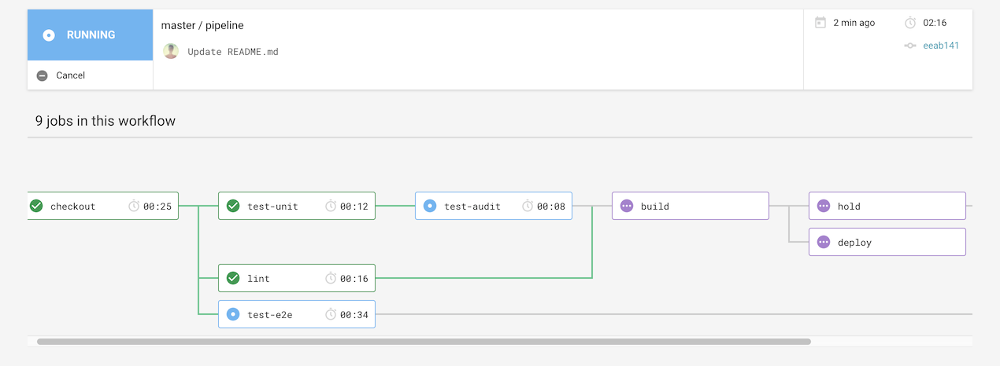
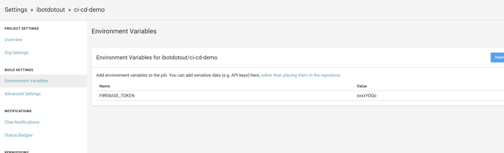

# ci-cd-demo [](https://circleci.com/gh/ibotdotout/ci-cd-demo)
[CircleCI](https://circleci.com/) pipeline example with [Vue.js](https://vuejs.org/)



## Most setting are in
- `packages.json`
- `.circleci/config.yml` - [CircleCI JS Config](https://circleci.com/docs/2.0/language-javascript/)

## Setup

1. Create two [Firebase projects](https://firebase.google.com/): staging & production
2. Edit `.firebaserc` to your firebase projects

```
{
  "projects": {
      "default": "###your-staging-project###",
      "production": "###your-production-project###"
  }
}
```
4. [Fork](https://help.github.com/en/articles/fork-a-repo) this repo to your account
5. Integrate your Github repo to [Circle CI](https://circleci.com/)
6. Get `FIREBASE_TOKEN` for CI by `npm run fb:login-ci` with [Firebase-tools](https://github.com/firebase/firebase-tools)
7. Add `FIREBASE_TOKEN` to CircleCI Project Settings: [Environment Variables](https://circleci.com/docs/2.0/env-vars/)


